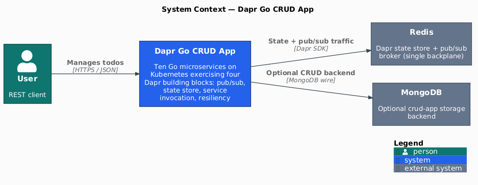
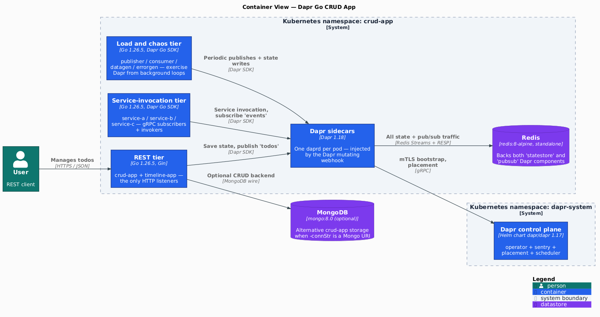
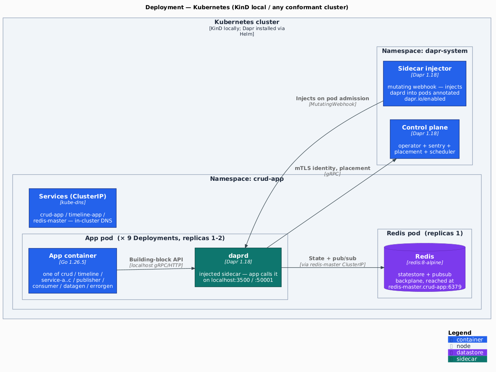
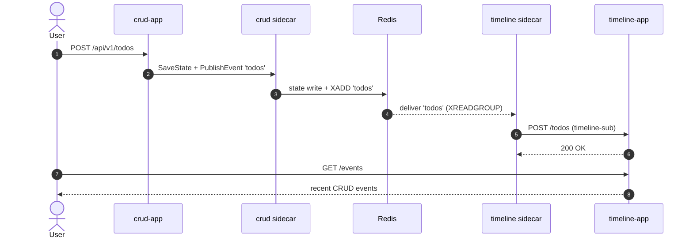
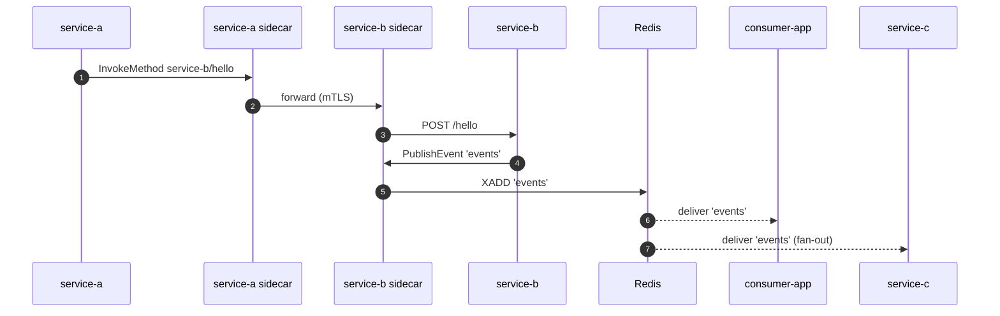

[](https://github.com/AndriyKalashnykov/dapr-go-crud-app/actions/workflows/ci.yml)
[](https://github.com/AndriyKalashnykov/dapr-go-crud-app)
[](https://opensource.org/licenses/MIT)
[](https://app.renovatebot.com/dashboard#github/AndriyKalashnykov/dapr-go-crud-app)

# Dapr Go Microservices on Kubernetes

Learn Dapr by running a real Go microservice topology on Kubernetes. The **learning surface** is ten Go services exercising four Dapr building blocks — pub/sub with content-based routing, state store, service invocation, and resiliency — across a single Redis backplane, with MongoDB as an optional storage backend. The **scaffolding surface** covers a three-layer test pyramid (unit, Testcontainers integration, KinD + Dapr e2e), a `make static-check` gate (golangci-lint, gosec, govulncheck, gitleaks, Trivy fs+config, actionlint, shellcheck, mermaid-lint, C4-PlantUML drift) and a supply-chain–hardened GitHub Actions pipeline (multi-arch `ko` build, Trivy image scan, cosign keyless OIDC signing to GHCR) on an `mise`-pinned toolchain with Renovate-managed dependencies.

<p align="center"></p>

## Tech Stack

| Component | Technology | Rationale |
|-----------|-----------|-----------|
| Language | Go 1.26.4 | First-class Dapr Go SDK; static binary deploys cleanly with `ko`. |
| HTTP routing | Gin | Minimal, well-known router with low boilerplate for sample apps. |
| Distributed runtime | Dapr Go SDK | Sidecar abstracts state store, pub/sub, and service invocation behind a single API. |
| State store + broker | Redis 8 (upstream image) | Single backing store for both `statestore` and `pubsub` Dapr components — one Deployment in `deploy/redis.yaml`, no Helm chart. |
| Optional backend | MongoDB 8.0 | Demonstrates pluggable storage interface (`storage.TodosStorage`) without touching app code. |
| Container build | ko 0.18 | Builds OCI images directly from Go source; no Dockerfile. |
| Orchestration | Kubernetes | Dapr injector + sidecar runs as `daprd` per pod via deployment annotations. |
| Toolchain manager | mise | Single source of truth for Go, Node, and every static-analysis binary; replaces gvm + nvm. |
| CI | GitHub Actions | Composite quality gate (`make static-check`) gated by a `changes` filter and a `ci-pass` aggregator. |

## Quick Start

```bash
make deps      # install mise + every pinned tool from .mise.toml
make build     # compile all 10 binaries into ./.bin/
make test      # go test -race ./...
make ci        # full local pipeline: deps + static-check + test + build
```

## Prerequisites

| Tool | Version | Purpose |
|------|---------|---------|
| [GNU Make](https://www.gnu.org/software/make/) | 3.81+ | Build orchestration |
| [Git](https://git-scm.com/) | latest | Source control |
| [Docker](https://www.docker.com/) | latest | Required by `make mongo-run`, `make mermaid-lint`, and the act-based local CI |
| [mise](https://mise.jdx.dev/) | latest | Cross-language version manager — installs Go, Node, and every static-analysis tool from `.mise.toml`; auto-installed by `make deps` |
| [Go](https://go.dev/dl/) | 1.26.4 | Pinned in `.mise.toml`; installed by `mise install` |
| [Node.js](https://nodejs.org/) | 24 | Used by `make renovate-validate` (`npx renovate`); installed by `mise install` |
| [kubectl](https://kubernetes.io/docs/tasks/tools/) | latest | Required by `make deploy` |
| [Helm](https://helm.sh/) | latest | Required by `make redis-deploy` |
| [Dapr CLI](https://docs.dapr.io/getting-started/install-dapr-cli/) | latest | Optional — `make dapr-run` for local sidecar |

Install everything with one command:

```bash
make deps
```

### Configuration (optional)

The defaults work out of the box. To override operator-tunable values (image
registry, namespace, KinD cluster name, cleanup retention, …), copy the
committed [`.env.example`](.env.example) to a gitignored `.env` and edit it —
the Makefile's `-include .env` makes those values authoritative for `make`:

```bash
cp .env.example .env    # then edit; e.g. set KO_DOCKER_REPO for your registry
```

## Architecture

The system runs as 10 sidecar-injected pods in the `crud-app` namespace, sharing a single Redis instance as both the Dapr state store and the pub/sub broker.



Key facts:

- **One Redis instance carries both Dapr components.** The `pubsub.redis` and `state.redis` components in `.dapr/components/` point at the same `redis-master.crud-app:6379` Service — the `subscriptionScopes` and `publishingScopes` metadata fields on the pubsub component are what make the topic routing work without separate brokers.
- **All app traffic goes through the daprd sidecar.** The apps never speak to Redis directly; they call `client.SaveState(...)` / `client.PublishEvent(...)` / `client.InvokeMethod(...)` against `localhost:50001` (the in-pod sidecar's gRPC port), and the sidecar talks to Redis on their behalf. That's the pattern the Dapr control plane (`dapr-system`) is bootstrapping.
- **Redis is `redis:8-alpine` standalone**, not a Helm chart. ~30 MB image, ephemeral storage (`emptyDir` for `/data`), password-protected via a Secret generated at deploy-time. Replaces an earlier `bitnami/redis` chart dependency.
- **MongoDB is optional**, used only when `crud-app` is launched with `-connStr=mongodb://...`. The default `-connStr=dapr` path goes through Redis via the Dapr state store.

### Deployment topology



- **daprd is injected, not declared.** Each app Deployment carries `dapr.io/enabled: "true"`; the Dapr sidecar-injector mutating webhook in `dapr-system` adds a `daprd` container to the pod at admission. The app and its sidecar share the pod network, so the app reaches Dapr on `localhost:3500` (HTTP) / `:50001` (gRPC) — standard sidecar injection, not shared/ambient.
- **Redis is a separate Deployment**, reached in-cluster at `redis-master.crud-app:6379` via a ClusterIP Service. Every app's sidecar (not the app) talks to it.
- **The control plane** (`operator + sentry + placement + scheduler`) runs in `dapr-system` from the `dapr/dapr` Helm chart; sidecars fetch their mTLS identity from sentry and register with placement over gRPC.

### Event flow

The C4 diagrams above show what exists; this sequence shows the pub/sub round-trip from a create to the timeline read — every hop goes through the daprd sidecar, never Redis directly.



The service-invocation chain plus the `events` fan-out — `service-a` calls `service-b` through the sidecars (mTLS), `service-b` publishes to `events`, and both `consumer-app` and `service-c` receive it:



Source files: [`docs/diagrams/c4-context.puml`](docs/diagrams/c4-context.puml), [`docs/diagrams/c4-container.puml`](docs/diagrams/c4-container.puml), [`docs/diagrams/c4-deployment.puml`](docs/diagrams/c4-deployment.puml) (C4-PlantUML, vendored stdlib under `docs/diagrams/C4-PlantUML/`); regenerate the PNGs with `make diagrams`.

### Apps

| App | Role |
|-----|------|
| `crud-app` (`cmd/app.go`) | REST `/api/v1/todos`; storage backend selected by `-connStr` flag (`mem` / `dapr` / Mongo URI). Publishes `todos` events to pub/sub when using the Dapr backend. |
| `timeline-app` (`cmd/timeline`) | Subscribes to `todos` topic via `timeline-sub`; serves the rolling timeline through `GET /events`. |
| `publisher-app` (`cmd/publisher`) | Periodically publishes to the `events` topic. |
| `consumer-app` (`cmd/consumer`) | Subscribes to the `events` topic; demonstrates state-store reads/writes. |
| `service-a` (`cmd/service-a`) | Service-invocation client; calls `service-b/method/hello` through the Dapr sidecar. |
| `service-b` (`cmd/service-b`) | Receives invocations on `/hello`; publishes follow-up `events` messages. |
| `service-c` (`cmd/service-c`) | Subscribes to the `events` topic alongside `consumer-app` (fan-out demo). |
| `datagen-app` (`cmd/datagen`) | Periodic state-store writer used to seed/keep load on Redis. |
| `dummy-app` (`cmd/dummy`) | Minimal HTTP receiver on `/events`; target of chaos invocations from `errorgen`. |
| `errorgen-app` (`cmd/errorgen`) | Chaos generator — exercises retries and resiliency policies by issuing intentionally-broken invocations. |

### Dapr components

| Component | Type | Notes |
|-----------|------|-------|
| `pubsub` | `pubsub.redis` | Topics: `todos` (publishingScope: `crud-app`) and `events` (publishingScopes: `publisher-app`, `service-b`). |
| `statestore` | `state.redis` | Scoped to `crud-app`, `datagen-app`, `consumer-app`. |
| `myresiliency` | Resiliency | Timeouts + retries + circuit breakers; scoped to `timeline-app`. |
| `service-a-resiliency` | Resiliency | Per-call retry + CB policy; scoped to `service-a`. |

### Subscriptions

| Subscription | Topic | Route | Subscriber |
|--------------|-------|-------|------------|
| `timeline-sub` | `todos` | `POST /todos` | `timeline-app` |
| `dummy-sub` | `todos` | `POST /todos-not-existent` | `timeline-app` (intentional 404 — chaos test) |

## API

`crud-app` exposes the CRUD surface on port 8080:

| Method | Path | Body | Effect |
|--------|------|------|--------|
| `GET`    | `/api/v1/todos`           | — | List todos |
| `POST`   | `/api/v1/todos`           | `{"text": "...", "done": false}` | Create todo |
| `PUT`    | `/api/v1/todos`           | `{"id": "...", "text": "...", "done": true}` | Update todo |
| `DELETE` | `/api/v1/todos`           | `{"id": "..."}` | Delete todo |

`timeline-app` exposes the timeline on port 8080:

| Method | Path | Body | Effect |
|--------|------|------|--------|
| `GET`  | `/events` | — | List recent CRUD events captured from the `todos` topic |
| `POST` | `/events` | CloudEvent or raw todo JSON | Internal endpoint — invoked by the Dapr `timeline-sub` subscription |

`dummy-app` exposes a no-op `/events` GET/POST for chaos exercises (port from `-port` flag, default 8080).

Quick smoke once the stack is deployed:

```bash
kubectl port-forward -n crud-app svc/crud-app 8080:8080 &
curl -X POST localhost:8080/api/v1/todos -d '{"text":"buy milk","done":false}' -H 'Content-Type: application/json'
curl localhost:8080/api/v1/todos
```

## Build & Package

| Stage | Command | Output |
|-------|---------|--------|
| Compile | `make build` | `./.bin/{app,consumer,datagen,dummy,errorgen,publisher,service-a,service-b,service-c,timeline}` |
| Local image build (no push, single-arch, `--base-import-paths`) | `make image-build` | `<binary>:scan` images in the local Docker daemon |
| Trivy scan local images | `make image-scan` | Fails on HIGH/CRITICAL — runs against `<binary>:scan` images |
| Smoke test local images | `make image-smoke-test` | Boots each binary briefly; fails any that crash within 5s |
| Publish images (multi-arch, gated) | `make push` | Multi-arch (`linux/amd64,linux/arm64`) push to `$KO_DOCKER_REPO`; depends on `image-scan` + `image-smoke-test`; default repo `ghcr.io/andriykalashnykov/dapr-go-crud-app` |
| Cosign keyless sign published images | `make image-sign` | Signs the digest of each `<repo>/<binary>:latest` (operator's `gh` OIDC identity) |

Override the registry per call (e.g., for Docker Hub):

```bash
KO_DOCKER_REPO=docker.io/youruser/dapr-go-crud-app make push
```

### Pre-push image hardening

The CI `docker` job runs the following gates **before** any image is pushed to GHCR. Any failure blocks the release.

| # | Gate | Catches | Tool |
|---|------|---------|------|
| 1 | Build local single-arch image | Build regressions on the runner architecture | `ko build --local --base-import-paths` |
| 2 | **Trivy image scan** (CRITICAL/HIGH blocking) | CVEs in the distroless base, OS packages, build layers | `aquasecurity/trivy-action` with `image-ref:` |
| 3 | **Smoke test** | Image boots without crash-looping in the first 5s | `scripts/image-smoke-test.sh` (`docker run` + status check) |
| 4 | Multi-arch build + push | Publishes for both `linux/amd64` and `linux/arm64` | `ko publish --platform=linux/amd64,linux/arm64` |
| 5 | **Cosign keyless OIDC signing** | Sigstore signature on the manifest digest | `sigstore/cosign-installer` + `cosign sign` |

Buildkit in-manifest attestations (`provenance` + `sbom`) are deliberately disabled — ko does not emit `unknown/unknown` attestation entries by default, so the GHCR Packages UI's "OS / Arch" tab renders correctly. Cosign keyless signing covers supply-chain verification.

Verify a published image's signature:

```bash
cosign verify ghcr.io/andriykalashnykov/dapr-go-crud-app/<binary>:<tag> \
  --certificate-identity-regexp 'https://github\.com/AndriyKalashnykov/dapr-go-crud-app/\.github/workflows/ci\.yml@refs/tags/v.*' \
  --certificate-oidc-issuer https://token.actions.githubusercontent.com
```

## Deployment

The `deploy/*.yaml` manifests reference `ghcr.io/andriykalashnykov/dapr-go-crud-app/<binary>:latest` images and assume Redis is reachable at `redis-master.crud-app:6379` — that name is hardcoded in the Dapr `pubsub` and `statestore` components, and `deploy/redis.yaml` provisions it. Pods use `imagePullPolicy: Always`, so `make rollout` re-pulls the latest image on every restart — convenient for following the `:latest` tag, but pin to `:vN.N.N` in the manifests for production deploys to make versions explicit.

```bash
make redis-deploy        # Apply deploy/redis.yaml (Deployment + Service + generated Secret)
make deploy              # Apply Dapr config + components + Deployments (no image rebuild)
make deploy-full         # ko publish + redis + apply (one-shot fresh deploy)
make rollout             # Restart the crud-app + timeline-app pods
make app-logs            # Tail crud-app logs
```

The `crud-app` namespace is created by `make apply` if missing. Override with `APP_NAMESPACE=other make deploy`.

## Available Make Targets

Run `make help` to see all targets. They are grouped here for reference.

### Build & Run

| Target | Description |
|--------|-------------|
| `make build` | Compile every binary into `./.bin/` |
| `make run` | Run `crud-app` locally (requires Dapr sidecar) |
| `make dapr-run` | Run `crud-app` under `dapr run` (depends on `build`) |
| `make clean` | Remove `./.bin/` and coverage output |
| `make update` | `go get -u ./...` + `go mod tidy` (allows major bumps) |
| `make update-minor` | `go get -u=patch ./...` + `go mod tidy` |

### Testing

| Target | Description |
|--------|-------------|
| `make test` | Unit tests — `go test -race ./...` (seconds; no infra) |
| `make integration-test` | Integration tests against real backends via Testcontainers — `go test -race -tags=integration -v ./...` (tens of seconds; requires Docker) |
| `make e2e` | Full e2e — `kind-up` + `dapr-install` + `e2e-redis-deploy` + `e2e-apply` + `e2e-smoke` (minutes; requires Docker) |
| `make e2e-smoke` | Smoke assertions only against an already-deployed cluster (CI-style invocation) |

### Static analysis (composite gate)

| Target | Description |
|--------|-------------|
| `make static-check` | Composite gate: `format-check` + `lint` + `lint-ci` + `shellcheck` + `sec` + `vulncheck` + `secrets` + `trivy-fs` + `trivy-config` + `mermaid-lint` |
| `make format` | `gofmt -w .` (mutates tree) |
| `make format-check` | Verify tree is gofmt-clean (CI gate) |
| `make lint` | golangci-lint (gocritic enabled via `.golangci.yml`) |
| `make lint-ci` | actionlint over `.github/workflows/` |
| `make shellcheck` | shellcheck over `scripts/` |
| `make sec` | gosec — HIGH/CRITICAL only |
| `make vulncheck` | govulncheck against project + std library |
| `make secrets` | gitleaks — exits non-zero on any committed secret |
| `make trivy-fs` | Trivy filesystem scan (vuln + secret + misconfig, HIGH/CRITICAL) |
| `make trivy-config` | Trivy IaC scan over `deploy/` and `.dapr/` |
| `make mermaid-lint` | Validate every ` ```mermaid ` block in `*.md` via the official Mermaid CLI |

### Container images

| Target | Description |
|--------|-------------|
| `make image-build` | Build images locally (no push, single-arch) |
| `make image-scan` | Trivy scan locally-built images (CRITICAL/HIGH blocking) |
| `make image-smoke-test` | Boot each binary briefly to verify it doesn't crash |
| `make push` | Multi-arch publish to `$KO_DOCKER_REPO` (gated on `image-scan` + `image-smoke-test`) |
| `make image-sign` | Cosign keyless sign every published `:latest` tag |

### Kubernetes

| Target | Description |
|--------|-------------|
| `make redis-deploy` | Apply `deploy/redis.yaml` (upstream `redis:8-alpine`, standalone) and generate the `redis-password` Secret |
| `make zipkin-deploy` | Deploy Zipkin into the namespace |
| `make apply` | Apply namespace + Dapr config + components + manifests |
| `make deploy` | `redis-deploy` + `apply` (no image rebuild) |
| `make deploy-full` | `push` + `deploy` (fresh end-to-end) |
| `make rollout` | Restart `crud-app` and `timeline-app` pods |
| `make app-logs` | Tail `crud-app` logs |
| `make mongo-run` | Run MongoDB locally in Docker (alternative storage backend) |
| `make kind-up` | Create the local KinD cluster (idempotent) |
| `make kind-down` | Delete the local KinD cluster |
| `make dapr-install` | Install Dapr control plane via Helm into the kind cluster |
| `make dapr-uninstall` | Uninstall Dapr control plane |
| `make e2e-redis-deploy` | Apply `deploy/redis.yaml` into the kind cluster (context-pinned) |
| `make e2e-apply` | Apply Dapr config + components + Deployments into the kind cluster (context-pinned) |

### CI

| Target | Description |
|--------|-------------|
| `make ci` | Full local pipeline (deps + static-check + test + build) |
| `make ci-run` | Run the GitHub Actions workflow locally via [act](https://github.com/nektos/act) |
| `make cleanup-runs` | Prune old GitHub Actions runs (`RETAIN_DAYS`, `KEEP_MINIMUM`) |
| `make renovate-validate` | Validate `renovate.json` via `npx renovate --platform=local` |

### Utilities

| Target | Description |
|--------|-------------|
| `make help` | List all available targets |
| `make deps` | Install mise + every pinned tool from `.mise.toml` |
| `make deps-prune` | Run `go mod tidy` |
| `make deps-prune-check` | Verify `go mod tidy` is a no-op (CI gate) |
| `make release` | Interactive `vN.N.N` tag-and-push |

## CI/CD

### `ci.yml`

Runs on every push to `main`, on `v*` tags, on pull requests, and via `workflow_call` (reusable).

| Job | Triggers / Needs | Steps |
|-----|------------------|-------|
| `changes` | All triggers | `dorny/paths-filter` positive allow-list for `code` + a `docs` output (`README.md`). Doc-only changes (README/LICENSE/docs/PNGs) skip the heavy jobs |
| `mermaid-lint` | `needs: [changes]`, only on doc-only changes (`code=false`, `docs=true`) | `make mermaid-lint` — validates the README's Mermaid diagram when `static-check` is skipped |
| `static-check` | `needs: [changes]`, only if `code` changed | `make static-check` (composite gate) |
| `build` | `needs: [changes, static-check]` | `make build` + upload `.bin/` artifacts |
| `test` | `needs: [changes, static-check]` | `make test` (unit) |
| `integration-test` | `needs: [changes, static-check]` | `make integration-test` (Testcontainers) |
| `e2e` | `needs: [changes, build]` | `helm/kind-action` → `make dapr-install` → `make e2e-redis-deploy` → `make e2e-apply` → `make e2e-smoke`; on failure dumps pod state + logs |
| `docker` | `needs: [static-check, build, test, integration-test, e2e]`, `if: startsWith(github.ref, 'refs/tags/')`, `strategy.matrix.binary` × 10 | Tag-gated supply-chain pipeline per /harden-image-pipeline Pattern A: ko build local → Trivy image scan (CRITICAL/HIGH) → smoke test → ko publish multi-arch (`linux/amd64,linux/arm64`) → cosign keyless OIDC signing by digest. Permissions `packages: write` + `id-token: write` are job-scoped. |
| `ci-pass` | `needs: [changes, mermaid-lint, static-check, build, test, integration-test, e2e, docker]`, `if: always()` | Aggregator — fails if any required job failed or was cancelled. Jobs `skipped` on doc-only / non-tag pushes are treated as non-failure. Use this as the single required-status-check rule. |

Concurrency: `cancel-in-progress: true`. Permissions: `contents: read` (jobwise; `changes` adds `pull-requests: read`).

### `cleanup-runs.yml`

Weekly cron (Sunday midnight UTC) plus manual `workflow_dispatch`. Calls `make cleanup-runs` with the in-job env (`RETAIN_DAYS=7`, `KEEP_MINIMUM=5`) so the same logic can be exercised locally. Permissions: `actions: write`.

### Required secrets and variables

| Name | Type | Used by | How to obtain |
|------|------|---------|---------------|
| `GITHUB_TOKEN` | Secret (built-in) | every job, including `docker` (GHCR push) | Provided automatically by GitHub Actions; no setup |

No additional secrets or variables are required. The `docker` job uses `GITHUB_TOKEN` for GHCR auth (repo-namespace path `ghcr.io/<owner>/<repo>/<pkg>` — `GITHUB_TOKEN` cannot publish to user-namespace paths) and OIDC for cosign keyless signing — no PAT or cosign keypair to manage.

[Renovate](https://docs.renovatebot.com/) tracks every dependency: Go modules, GitHub Actions, the `.mise.toml` toolchain (via the native `mise` manager), and Makefile inline-comment pins (`MONGO_VERSION`, `ZIPKIN_VERSION`, `ACT_UBUNTU_VERSION`, `MERMAID_CLI_VERSION`). Toolchain bumps are grouped into a single PR.

## Test coverage

Three layers, three Makefile targets, three CI jobs:

| Layer | Command | Covers | Runtime | Infra |
|-------|---------|--------|---------|-------|
| Unit | `make test` | `pkg/storage` (in-mem FIFO eviction; `DaprStorage` via injectable client interface — Create/Update/Delete/ListAll, FIFO eviction, error propagation), `pkg/timeline` (Handle branches), `pkg/server` (cleanupLoop / generateLoadLoop ticker injection), `cmd/timeline` (CloudEvent vs raw decode + handler), `cmd/app` (`selectStorage` routing) | seconds | none |
| Integration | `make integration-test` | `pkg/storage.MongoStorage` (Testcontainers `mongo:8.0`, CRUD round-trip + `_id`/`todoId` mapping + maxItems cap), `pkg/server` HTTP handlers (httptest.NewServer + InMemoryStorage + 400 on bad JSON / missing required field) | tens of seconds | Docker |
| E2E | `make e2e` (or `make e2e-smoke` against running cluster) | crud-app HTTP CRUD round-trip; pubsub `crud-app → todos → timeline-app`; service-invocation `service-a → service-b`; pubsub fan-out `events → consumer + service-c`; negatives (malformed JSON, missing required, 404) | minutes | KinD + Dapr Helm + upstream redis:8 |

`make ci` runs unit + integration + build + static-check end-to-end. The e2e job runs only in CI (and on demand locally via `make e2e`) because it provisions a real cluster.

`DaprStorage` is unit-tested via Pattern B (a minimal `daprStateClient` interface defined at the use site, with an in-memory fake) — same level of correctness as a Testcontainers daprd would give, at unit-test speed, with no infrastructure. The e2e layer additionally exercises the real `daprd` sidecar end-to-end.

## Contributing

Contributions are welcome — open a PR. Run `make ci` locally before pushing.

## References

- [Original crud app](https://github.com/famarting/crud-app)
- [Dapr documentation](https://docs.dapr.io/)
- [ko documentation](https://ko.build/)
